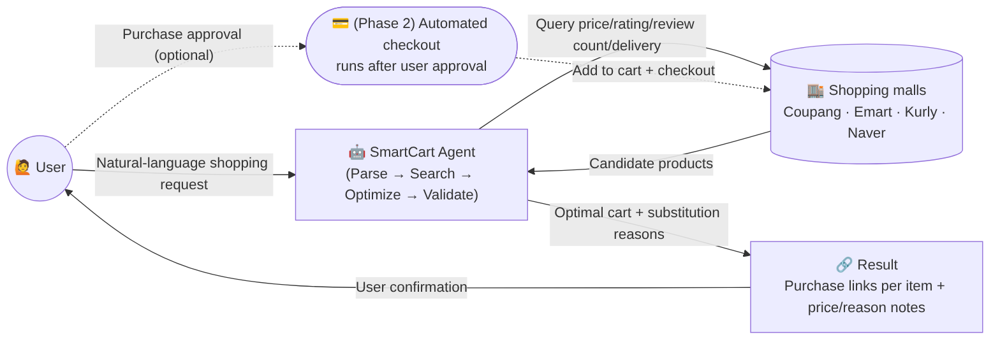
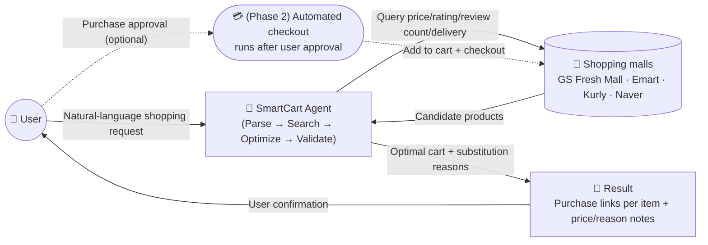
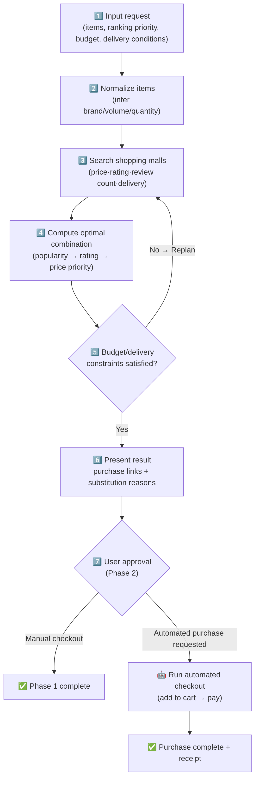
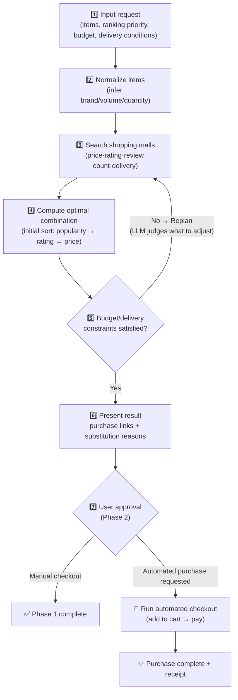
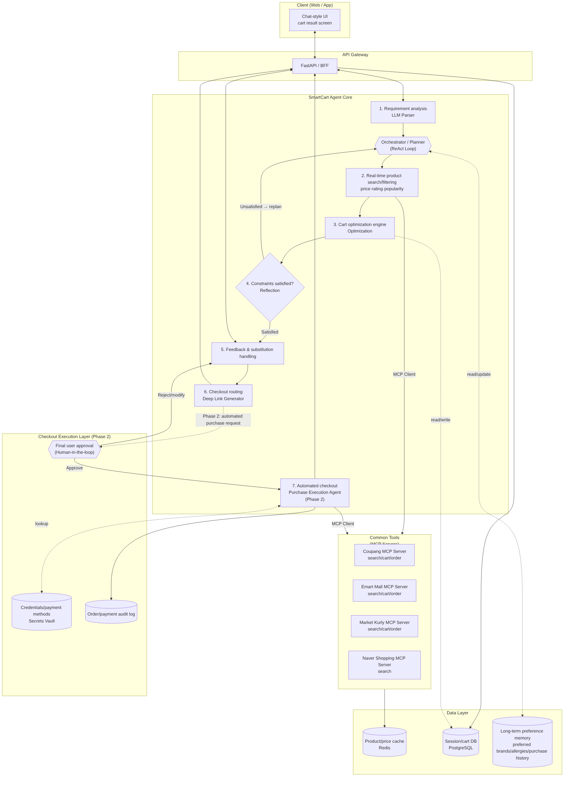
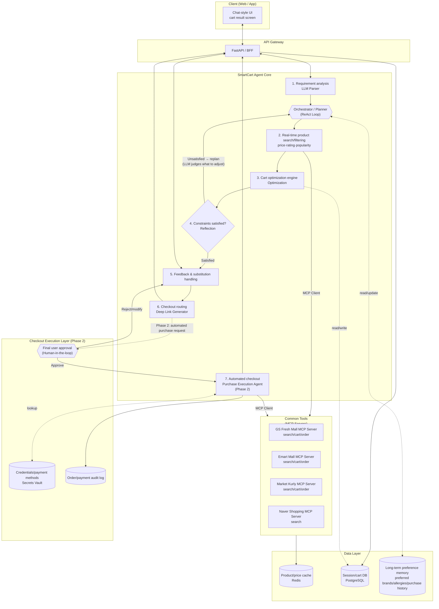
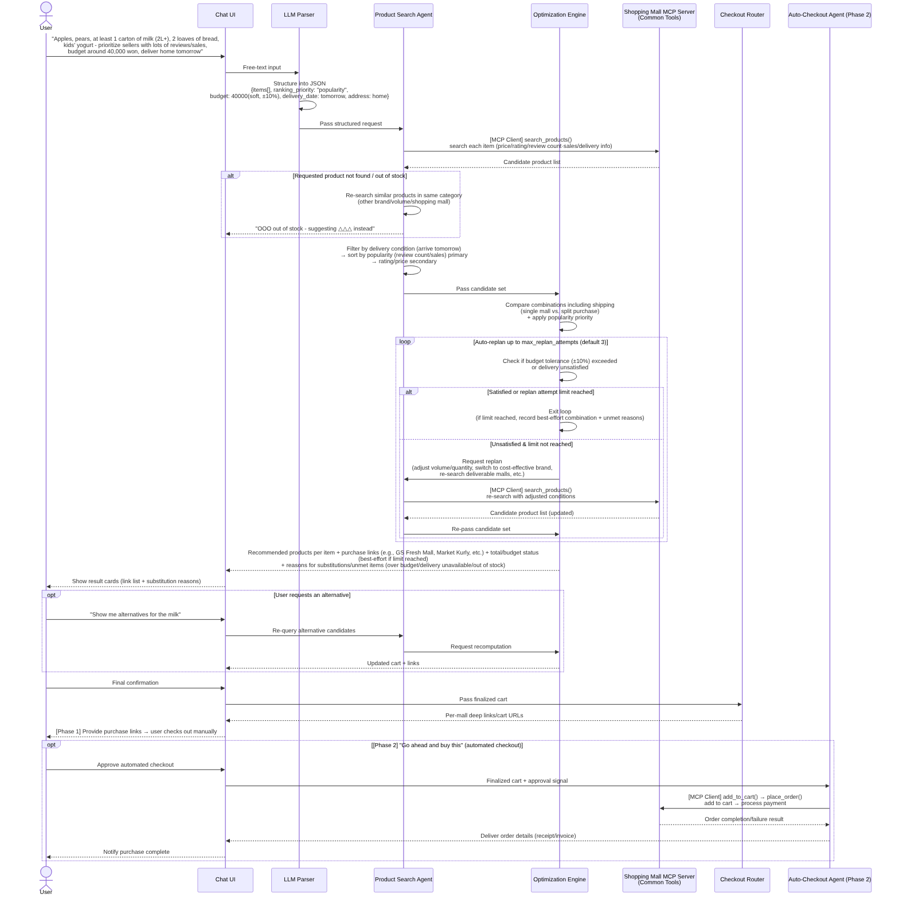
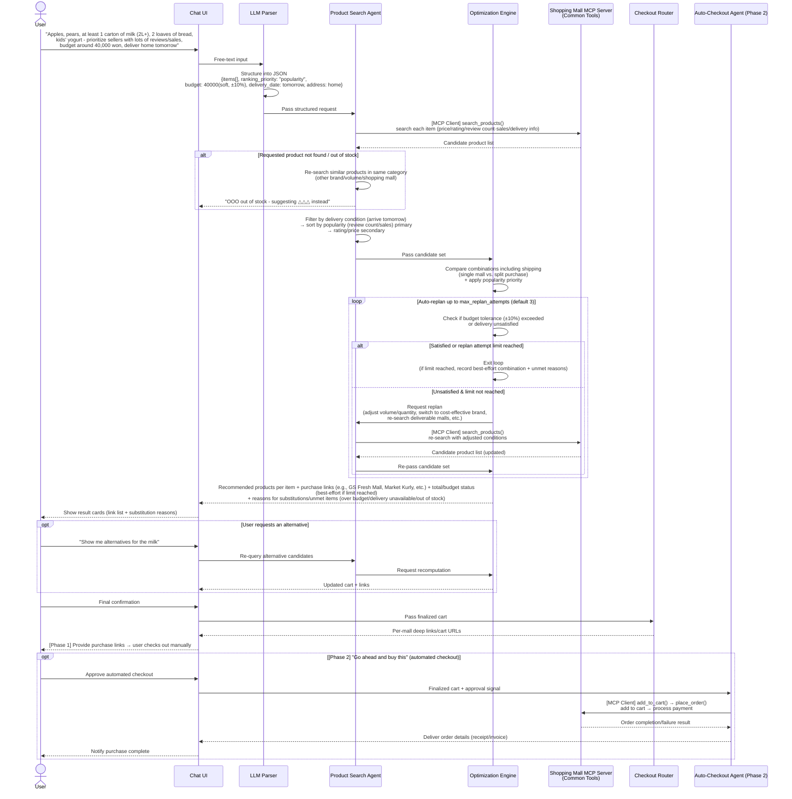

# SmartCart Agent 🛒🤖

> AI-powered intelligent grocery shopping agent
> Given a natural-language shopping list, this agent finds the optimal combination of
> purchases across multiple e-commerce sites that satisfies **lowest price · highest
> rating · desired delivery time**, and shortens the journey all the way up to checkout.

> 🇰🇷 한국어 버전은 [README.md](./README.md)를 참고하세요.

---

## 1. Overview

When a user enters a casual shopping list such as "1kg of pork belly, ssamjang,
a bag of lettuce, arriving before 7am tomorrow, budget under 40,000 won", the agent:

1. Normalizes each item (inferring brand/volume/quantity, asking clarifying
   questions when ambiguous)
2. Queries multiple e-commerce sites (GS Fresh Mall, Emart Mall, Kurly, Naver Shopping,
   etc.) in real time for price, rating, **review count/sales volume
   (popularity)**, and delivery availability
3. Computes the **optimal cart combination (Optimization Pack)** including
   shipping cost, **self-validates budget (including approximate budgets) and
   delivery constraints**, and automatically replans if they are not met
4. Presents the user with a suggestion plus alternative options
5. **[Phase 1]** Provides **deep links / cart links** for each shopping mall so the
   user can check out directly, or
   **[Phase 2]** With the user's approval, **automatically completes checkout**.

### 1.1 Example Scenario

> **User input**
> "Find me apples, pears, at least 1 carton of milk (2L or more), 2 loaves of
> bread, and kids' yogurt.
> Prioritize sellers with lots of reviews or sales, my budget is around 40,000
> won, and I'd like it delivered home tomorrow."

This input is processed as follows:

1. **Parser** — Normalizes 5 items (apples, pears, milk≥2L×1, bread×2, kids'
   yogurt), sets the ranking priority to `popularity` (review count/sales
   volume), classifies the budget as **approximate (soft budget, ≈40,000
   won)**, and extracts the delivery condition as **"arrive home tomorrow"**
   (time unspecified)
2. **Search Agent** — Looks up candidate products for each item and performs
   an initial sort based on review count and sales volume (best-seller rank)
3. **Optimizer** — Computes the optimal combination where the total
   (including shipping) falls within the approximate budget (± tolerance),
   prioritizing popularity with rating/price as secondary criteria
4. **Reflection** — If any item exceeds the budget or cannot be delivered in
   time, replans by substituting a cheaper or deliverable alternative in the
   same category, and **records why each item was substituted (over budget /
   delivery unavailable / out of stock)**
5. **Output (Phase 1)** — Presents the recommended product per item +
   **purchase links (deep links)**, total amount/budget status, and the
   **reasons for any substitutions made during replanning (original product,
   reason, replacement product)**
6. **Output (Phase 2, future)** — Once the user confirms "go ahead and buy
   this", the Purchase Execution Agent adds the items to each shopping mall's
   cart and completes checkout on the user's behalf

---

## 2. Core Features

### 🔹 Stage 1 — Intelligent Item Matching & Optimization
- **Natural language parsing**: "extra-large pork belly, dish soap" → inferred
  brand/volume/quantity converted into structured data
- **Ambiguity resolution**: For items with low parsing confidence (e.g. "dish
  soap" → many possible brands/sizes), the agent either asks a short
  clarifying question or presents its best guess along with the reasoning
- **Multi-criteria search**: Compares price + rating (e.g. 4.5/5.0 or higher) +
  **review count/sales volume (popularity)** across multiple shopping malls
- **Customizable ranking priority**: Requests like "sellers with lots of
  reviews or sales" set `popularity` (review count, sales volume, best-seller
  rank) as the primary sort criterion, with rating and price as secondary
  criteria for ties
- **Optimal combination generation**: Produces a shopping-mall combination
  that satisfies the ranking priority (popularity/rating/price) while keeping
  the total (including shipping) within the (approximate) budget, along with
  **direct purchase links**

### 🔹 Stage 2 — Flexible Alternative Recommendations (Alternative Engine)
- **One-click swap**: If a recommended product isn't satisfactory, instantly
  suggests the next-cheapest option or a different brand in the same category
- **Filter by preference**: Sort by "cheaper option", "higher rated", "organic
  / eco-friendly", etc.
- **Automatic handling of out-of-stock/unavailable items**: If a requested
  product isn't found or is out of stock, the agent notifies the user and:
  - Automatically re-searches for similar products in the same category
    (different brand/volume)
  - Checks stock availability across other shopping malls
  - Suggests an alternative in the form: "The OOO you requested is currently
    out of stock. We recommend △△△ (different brand/volume) instead."

### 🔹 Stage 3 — Simultaneous Budget & Delivery Time Matching (Budget & Delivery Routing)
- **Budget guardrails**: Automatically suggests adjusting quantity/volume or
  switching to a more cost-effective brand to stay within budget
- **Approximate (soft) budget handling**: For phrases like "around 40,000
  won" (not a strict cap), the agent searches for combinations that satisfy
  the popularity/rating priority within **±10% tolerance** of the base
  budget; if it falls outside the tolerance, the overage and reason are
  reported to the user
- **Delivery timeline matching**: Filters to shopping malls (GS Fresh, SSG
  Delivery, Kurly, etc.) that satisfy the desired arrival time (e.g. "before
  7am tomorrow") or date-level conditions (e.g. "home by tomorrow")

### 🔹 Stage 4 — Purchase Links & Automated Checkout (Output & Checkout)
- **[Phase 1] Purchase links**: Once the optimal combination is finalized, the
  agent compiles per-item shopping-mall deep links/cart URLs for the user, who
  clicks through to check out manually
- **[Phase 2] Automated checkout**: Once the user gives final approval, the
  Purchase Execution Agent adds items to each shopping mall's cart using a
  logged-in session and completes checkout on the user's behalf. The step
  immediately before payment always requires **human-in-the-loop approval**,
  and the entire process is recorded in an Audit Log

---

## 3. System Architecture

### 3.0 Architecture at a Glance (Simple View)

> The diagrams below simplify the flow down to its essentials so non-developers
> can follow along. See the diagrams in 3.1–3.2 for the detailed module/connection
> structure.

#### Overall Structure (Simple)



<details>
<summary>View Mermaid source (when editing, also update docs/diagrams/src/01-overview-simple.en.mmd and regenerate the PNG)</summary>



</details>

#### Processing Flow (Simple)




<details>
<summary>View Mermaid source (when editing, also update docs/diagrams/src/02-pipeline-simple.en.mmd and regenerate the PNG)</summary>



</details>

---

### 3.1 Overall Architecture (Detailed)



<details>
<summary>View Mermaid source (when editing, also update docs/diagrams/src/03-architecture-detail.en.mmd and regenerate the PNG)</summary>



</details>

### 3.2 Processing Pipeline (Detailed Sequence)



<details>
<summary>View Mermaid source (when editing, also update docs/diagrams/src/04-sequence-detail.en.mmd and regenerate the PNG)</summary>



</details>

### 3.3 Module Composition

| Module | Responsibility | Key Technologies | Type |
|---|---|---|---|
| **Request Parser** | Converts free-form input into structured JSON (items, quantity/spec, ranking priority, budget (hard/soft), delivery deadline/address). Generates clarifying questions when confidence is low | LLM (Function Calling / Structured Output) | 🟢 Agent |
| **Orchestrator (Planner)** | Decomposes the overall task into sub-steps and controls the Search→Optimize→Reflect loop. Triggers replanning based on Reflection results | LLM Agent Loop (ReAct / Plan-Execute) | 🟢 Agent |
| **Product Search Agent** | Calls each shopping mall's search tool and performs initial filtering/sorting by delivery condition/price/rating/**review count·sales (popularity)** | LLM Tool-use (MCP Client) → per-mall MCP Server | 🟢 Agent |
| **Optimization Engine** | Computes the combination (single mall vs. split purchase) that satisfies the ranking priority (popularity/rating/price) while keeping the total including shipping within the (approximate) budget | Combinatorial optimization algorithm (Knapsack/Greedy + constraints) | 🔧 Tool (called by Orchestrator/Reflection) |
| **Reflection Module** | Self-validates whether the computed combination satisfies budget (including tolerance)/delivery constraints, and triggers replanning if not. **Records substituted items with a reason code (`budget_exceeded`/`delivery_unavailable`/`out_of_stock`) and explanation**. `ranking_priority` is only the sort criterion for the initial search/optimization — which conditions to adjust during replanning (volume/quantity/brand/shopping mall, etc.) are not fixed rules; **the LLM judges this for itself based on the situation**. **Replanning is attempted at most `max_replan_attempts` times (default 3)**; once the limit is reached, the best combination found so far is presented as a best-effort result along with the unmet reasons | Rule-based validation + LLM evaluation | 🟢 Agent |
| **Alternative Engine** | Ranks alternative candidates (price/rating/popularity/eco-friendly, etc.) and **automatically finds/suggests similar products in the same category when an item is out of stock or unavailable** | Rule-based + re-invoking search | 🔧 Tool (called by Search/Reflection) |
| **Deep Link Router** | Generates per-mall product/cart URLs from the final cart (**Phase 1 primary output**) | Per-mall URL scheme mapping | 🔧 Tool (called by Orchestrator) |
| **Shopping Mall Connector (MCP Server)** | Exposes each mall's product search/detail lookup/cart/order functions as standard MCP Tools (`search_products`, `get_product_detail`, `add_to_cart`, `place_order`, etc.). API-first, with crawlers for unofficial channels | MCP Server (GS Fresh Mall/Emart/Kurly/Naver, each independently deployed) | 🔧 Tool (called via MCP Client by Search/Purchase Agent) |
| **Purchase Execution Agent (Phase 2)** | After final user approval, adds items to each mall's cart and automatically completes checkout, retrieving order results (receipt/invoice) | LLM Tool-use (MCP Client) → per-mall MCP Server (cart/order tools), Browser Automation (Playwright) | 🟢 Agent |
| **Session Store** | Manages user sessions, cart state, and feedback history | PostgreSQL / Redis | ⚪ Infra |
| **Preference Memory** | Stores long-term user preferences across sessions (preferred brands, allergies/excluded foods, ranking priority, frequently purchased items) and applies them to future searches | PostgreSQL (vector/structured) | ⚪ Infra |
| **Secrets Vault (Phase 2)** | Encrypts and stores shopping mall login/payment credentials, retrieved by the Purchase Agent only at execution time | Vault / KMS-based encrypted storage | ⚪ Infra |
| **Audit Log (Phase 2)** | Records all automated purchase requests, approvals, and order results for tracing/rollback | Append-only log (PostgreSQL/S3) | ⚪ Infra |

### 3.3.1 Agent vs. Tool vs. Infra Distinction

Not every module in the SmartCart Agent Core needs to be an LLM agent. Only
modules that require **judgment/planning** are agents; **deterministic
computation/mapping with fixed inputs/outputs** is implemented as a **tool that
agents call**.

- 🟢 **Agent (LLM-based, 5 total)** — assesses the situation and plans the next
  action on its own
  - **Orchestrator**: The main agent. Controls the Search→Optimize→Reflect
    loop and decides whether to replan
  - **Request Parser**: Structures natural-language requests and generates
    clarifying questions for ambiguous items
  - **Product Search Agent**: Calls search tools and adjusts the search
    strategy based on results
  - **Reflection Module**: Evaluates the Optimizer's results and generates the
    explanation shown to the user for substitutions
  - **Purchase Execution Agent (Phase 2)**: Executes automated checkout and
    handles exceptions (out of stock, payment failure, etc.)

- 🔧 **Tool (deterministic functions/external integrations, 4 total)** —
  computation/mapping that always produces the same result for the same input,
  or external integrations exposed via a standard interface. Fast, cheap, and
  easy to test
  - **Optimization Engine**: `optimize_cart()` — combination optimization
    computation
  - **Alternative Engine**: `get_alternatives()` — ranks/filters alternative
    candidates
  - **Deep Link Router**: `build_deep_link()` — generates per-mall URLs
  - **Shopping Mall Connector (MCP Server)**: Standardizes each mall's
    API/crawler as **MCP Tools** such as `search_products`,
    `get_product_detail`, `add_to_cart`, and `place_order`. Search/Purchase
    Agents call them the same way via MCP Client → adding/replacing a
    shopping mall only requires adding an MCP Server, with no agent logic
    changes

- ⚪ **Infra (data/security layer, 4 total)** — storage that agents read from
  and write to
  - Session Store, Preference Memory, Secrets Vault (Phase 2), Audit Log
    (Phase 2)

> In other words, turning the Optimizer/Alternative Engine/Router into LLM
> agents would increase cost and latency and make results non-deterministic
> (harder to debug). We recommend keeping them as tools, called via tool-use by
> the Orchestrator/Reflection agents.

### 3.4 Agentic AI Requirements Checklist

| Requirement | How It's Addressed |
|---|---|
| **Autonomy** | Unless the user rejects the result, search → optimize → constraint validation → replanning all run automatically without human intervention |
| **Plan & Replan** | The Orchestrator decomposes goals (budget/delivery time/rating) into sub-tasks, and Reflection automatically replans (adjusting quantity, switching brands, re-searching) when constraints aren't met. **Replanning termination**: after at most `max_replan_attempts` (default 3) tries, if constraints are still unmet, present the best combination found so far (best-effort) along with the unmet reasons, avoiding infinite loops |
| **Tool Use** | The Search/Purchase Agent acquires real-time data by calling each shopping mall's **MCP Server (Common Tools)** for search, cart, and order functions as standardized tools |
| **Reflection / Self-verification** | The Reflection module validates the Optimization results and self-improves through the loop on failure |
| **Transparency** | Items substituted during replanning have their **substitution reason (over budget/delivery unavailable/out of stock)** clearly stated in the final result alongside the original and replacement products |
| **Memory** | Uses not only in-session state (Session Store) but also cross-session long-term preferences (Preference Memory) to inform future requests |
| **Ambiguity Resolution / Human-in-the-loop** | Items with low parser confidence trigger a clarifying question or a best-guess suggestion with reasoning. A user confirmation step is retained before final checkout |
| **Goal/Constraint Tracking** | Budget (hard/soft, tolerance), delivery deadline/date, and ranking priority (popularity/rating/price) are consistently tracked across the entire pipeline, with satisfaction status shown in the final result |
| **Safe Autonomous Execution (Phase 2 Safety)** | Automated checkout always requires **user approval (HITL)** immediately before payment; credentials are retrieved from the Secrets Vault only at execution time; all order actions are recorded in the Audit Log for traceability/refund handling |

---

## 4. Sample Data Model

### 4.1 Structured Request (Parser Output)

```json
{
  "items": [
    { "name": "apple", "qty": 1, "unit": "bag", "category": "fruit" },
    { "name": "pear", "qty": 1, "unit": "bag", "category": "fruit" },
    { "name": "milk", "qty": 1, "unit": "carton", "min_volume": "2L", "category": "dairy" },
    { "name": "bread", "qty": 2, "unit": "loaf", "category": "bakery" },
    { "name": "kids' yogurt", "qty": 1, "unit": "pack", "category": "dairy" }
  ],
  "ranking_priority": ["popularity", "rating", "price"],
  "budget": { "amount": 40000, "type": "soft", "tolerance_pct": 10 },
  "delivery": { "date": "2026-06-13", "time": null, "address": "home" },
  "preferences": {
    "min_rating": null,
    "organic_preferred": false
  }
}
```

> `ranking_priority`: For requests like "sellers with lots of reviews or sales",
> set `popularity` (review count/sales volume/best-seller rank) as the primary
> criterion
> `budget.type`: Expressions like "about/around" map to `soft`; "or less/within"
> maps to `hard`

### 4.2 Optimization Result (Optimization Pack)

```json
{
  "total_price": 38700,
  "budget": { "amount": 40000, "type": "soft", "tolerance_pct": 10 },
  "budget_satisfied": true,
  "delivery": { "date": "2026-06-13", "satisfied": true },
  "ranking_priority": ["popularity", "rating", "price"],
  "cart": [
    {
      "item": "apple",
      "mall": "Market Kurly",
      "product": "Apples 1.5kg (5-6 ct)",
      "price": 12900,
      "rating": 4.7,
      "review_count": 18342,
      "delivery_date": "2026-06-13",
      "url": "https://www.kurly.com/goods/..."
    },
    {
      "item": "pear",
      "mall": "GS Fresh Mall (GS Fresh)",
      "product": "Sinko Pears 3 ct, premium",
      "price": 9900,
      "rating": 4.6,
      "review_count": 25110,
      "delivery_date": "2026-06-13",
      "url": "https://www.gsfresh.com/..."
    },
    {
      "item": "milk 2L or more",
      "mall": "GS Fresh Mall (GS Fresh)",
      "product": "Seoul Milk Farm Fresh 2.3L",
      "price": 4980,
      "rating": 4.8,
      "review_count": 41203,
      "delivery_date": "2026-06-13",
      "url": "https://www.gsfresh.com/..."
    },
    {
      "item": "bread x2",
      "mall": "GS Fresh Mall (GS Fresh)",
      "product": "Samlip Bread 500g",
      "price": 3290,
      "rating": 4.5,
      "review_count": 9870,
      "qty": 2,
      "delivery_date": "2026-06-13",
      "url": "https://www.gsfresh.com/..."
    },
    {
      "item": "kids' yogurt",
      "mall": "Emart (SSG Delivery)",
      "product": "Foremost Kids' Yogurt 100ml x 15 ct",
      "price": 7600,
      "rating": 4.6,
      "review_count": 6520,
      "delivery_date": "2026-06-13",
      "url": "https://emart.ssg.com/..."
    }
  ],
  "substitutions": [
    {
      "original_item": "milk 2L or more",
      "original_product": "Maeil Milk Greek Yogurt 2.3L (Premium)",
      "original_price": 8900,
      "reason": "budget_exceeded",
      "reason_detail": "Substituted with a cheaper product in the same category because it exceeded the budget tolerance (±10%, max 44,000 won)",
      "replacement_product": "Seoul Milk Farm Fresh 2.3L",
      "replacement_price": 4980
    }
  ],
  "alternatives": [
    {
      "for_item": "kids' yogurt",
      "suggestion": "Namyang Aikkoya Yogurt 80ml x 12 ct",
      "price": 6900,
      "review_count": 15230,
      "reason": "Higher review count/sales volume"
    }
  ]
}
```

> `substitutions`: Records items that were **actually substituted** during the
> Reflection step due to unmet budget/delivery constraints.
> `reason` is standardized as one of `budget_exceeded` | `delivery_unavailable`
> | `out_of_stock`, and `reason_detail` is the explanation shown directly to the
> user. (`alternatives` are optional recommended candidates the user can choose
> to swap to, separate from `substitutions`)

---

## 5. Technology Stack (Proposed)

| Area | Candidate Technologies |
|---|---|
| LLM / Agent framework | Claude (Function Calling / Tool Use), LangGraph or custom orchestration |
| Backend API | Python (FastAPI) |
| Product data collection | Official Open APIs first; crawlers (Playwright/requests) for unofficial channels |
| Tool integration (Common Tools) | Per-mall connectors (API/crawler) implemented as **MCP Servers** (`search_products`/`get_product_detail`/`add_to_cart`/`place_order`); Search/Purchase Agents call them via MCP Client |
| Cache | Redis (TTL management for price/product/popularity (review count·sales) cache) |
| DB | PostgreSQL (sessions, carts, user preferences) |
| Frontend | React / Next.js (chat-style UI + card-based result/link view) |
| Automated checkout (Phase 2) | Playwright-based browser automation, per-mall checkout integration, Secrets Vault (credentials/payment methods) |
| Deployment | Docker, CI/CD (GitHub Actions) |

---

## 6. Roadmap

### Phase 1 — Provide Purchase Links (Current Goal)
- [ ] Step 1: Natural-language parser + single shopping mall (GS Fresh Mall) integration PoC
- [ ] Step 2: Multi-mall comparison and optimization algorithm including shipping cost
- [ ] Step 3: Popularity-based (review count/sales) ranking priority + alternative recommendation engine
- [ ] Step 4: Approximate (soft) budget handling + delivery date/time filtering
- [ ] Step 5: Per-item deep links + user feedback loop

### Phase 2 — Automated Checkout (Future)
- [ ] Step 6: Secrets Vault integration (storing shopping mall login/payment methods)
- [ ] Step 7: Purchase Execution Agent (add to cart → automated checkout, Playwright-based)
- [ ] Step 8: Human-in-the-loop approval flow immediately before payment
- [ ] Step 9: Order/payment Audit Log + retrieval and notification of order results (receipt/invoice)

---

## 7. License

This project is licensed under the [LICENSE](./LICENSE) file.
