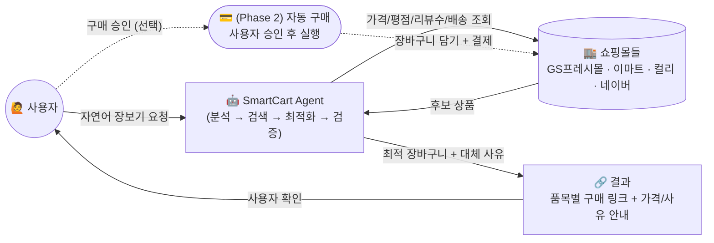
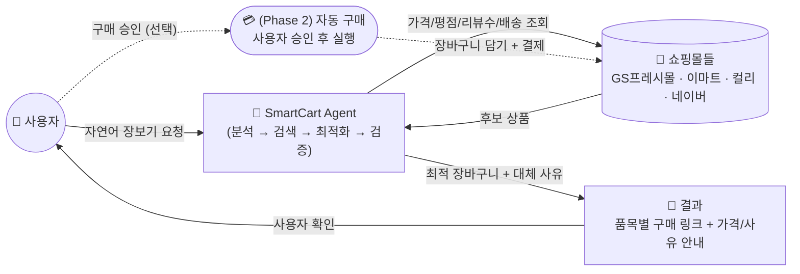
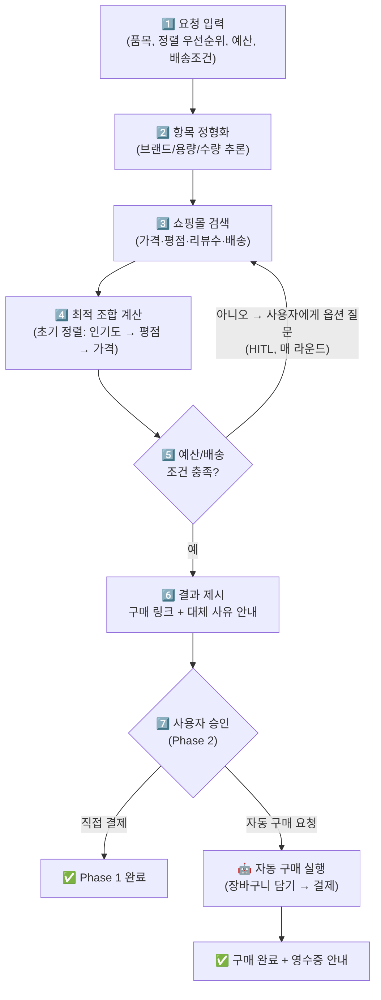
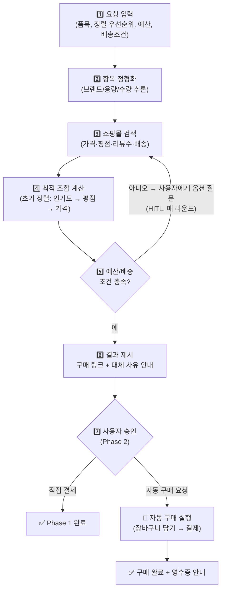
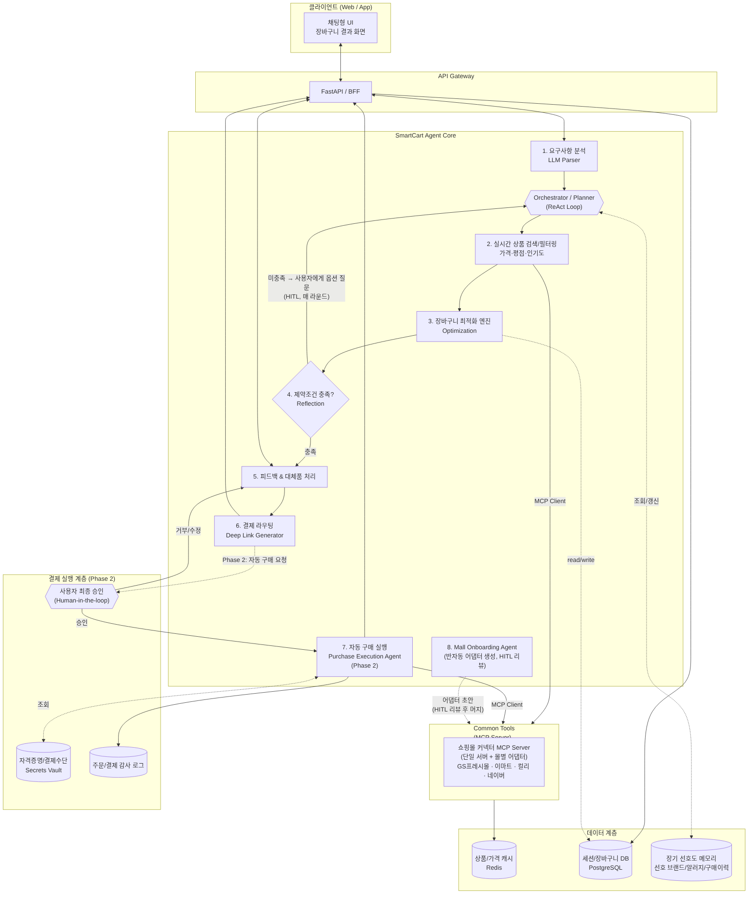
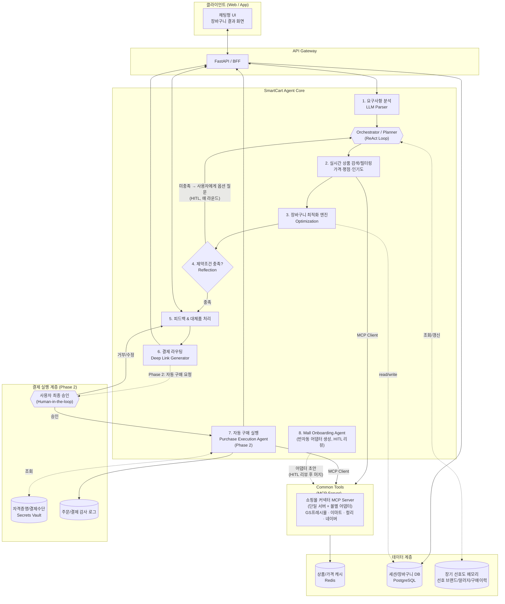
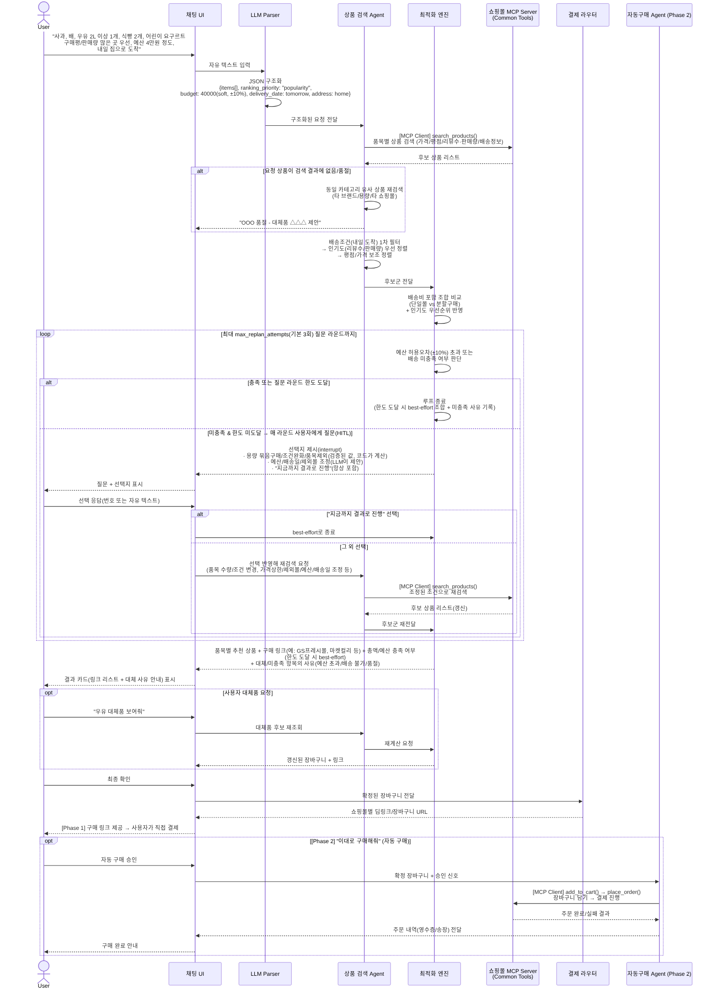
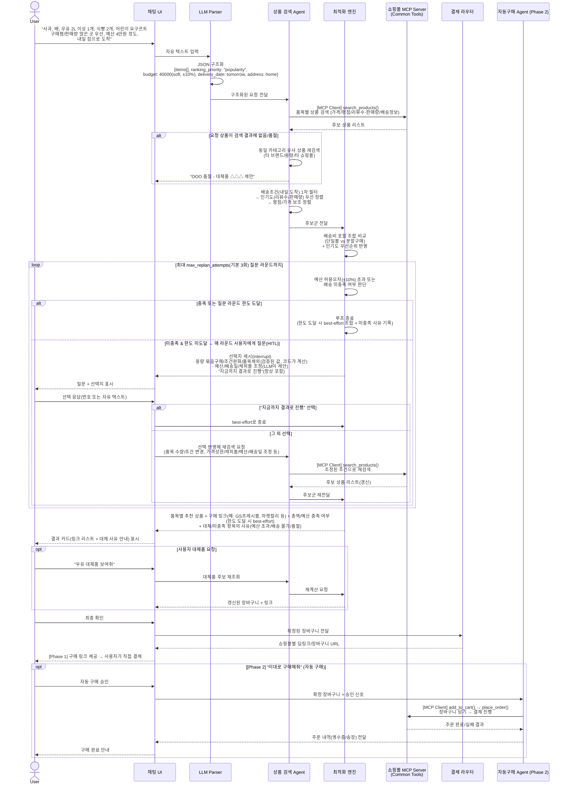

# SmartCart Agent 🛒🤖

> 🇺🇸 [English version](./README.en.md)

> AI 기반 지능형 장보기 대행 에이전트
> 자연어 장보기 리스트를 입력하면 **최저가 · 최고 평점 · 희망 배송 시간**을 모두 만족하는
> 최적의 구매 조합을 찾아주고, 결제 직전까지 여정을 단축해주는 에이전트 서비스입니다.

---

## 1. 개요

사용자가 "삼겹살 1kg, 쌈장, 상추 한 봉지, 내일 아침 7시 전 도착, 예산 4만원 이하"처럼
구어체로 입력한 장보기 리스트를 분석하여,

1. 항목을 정형화하고 (브랜드/용량/수량 추론, 모호하면 확인 질문)
2. 여러 이커머스(GS프레시몰, 이마트몰, 컬리, 네이버 쇼핑 등)에서 실시간 가격·평점·**리뷰 수/판매량(인기도)**·배송 가능 시간을 조회하고
3. 배송비를 포함한 **최적 장바구니 조합(Optimization Pack)**을 계산하고, **예산(근사치 포함)/배송 제약을 스스로 검증**하여 미충족 시 매 라운드 사용자에게 선택지를 묻고 응답에 따라 재계획하며(HITL)
4. 사용자에게 제안 + 대체품 옵션을 제공하고
5. **[Phase 1]** 각 쇼핑몰의 **딥링크/장바구니 링크**를 제공하여 사용자가 직접 결제하거나,
   **[Phase 2]** 사용자 승인을 거쳐 **자동으로 결제까지 수행**합니다.

### 1.1 예시 시나리오

> **사용자 입력**
> "사과, 배 과일, 우유 2L 이상 1개, 식빵 2개, 어린이 요구르트 찾아줘.
> 구매평이나 구매가 많은 곳으로 우선적으로 찾고, 예산은 4만원 정도 사용하고,
> 집으로 내일 받아봤으면 좋겠어."

이 입력은 다음과 같이 처리됩니다.

1. **Parser** — 5개 품목(사과, 배, 우유≥2L×1, 식빵×2, 어린이 요구르트)을 정형화하고,
   정렬 우선순위를 `popularity`(리뷰 수/판매량)로, 예산을 **근사치(soft budget, ≈40,000원)**로,
   배송 조건을 **"내일 집 주소로 도착"**(시간 미지정)으로 추출
2. **Search Agent** — 각 품목별로 후보 상품을 조회하고 리뷰 수·판매량(베스트 순위) 기준으로 1차 정렬
3. **Optimizer** — 배송비 포함 총액이 예산 근사치(±허용오차) 내에서, 인기도 우선 + 평점/가격을 보조 기준으로 최적 조합 산출
4. **Reflection** — 예산 초과/배송 불가/품절 항목이 있으면, 검증된 선택지(용량 묶음구매·조건완화·품목제외 — 코드가 계산)와 LLM이 제안한 선택지(예산/배송일 조정·몰 제외)를 함께 사용자에게 제시(HITL)하고, 선택에 따라 재검색 — 만족할 때까지 또는 **최대 `max_replan_attempts`회**까지 라운드 반복
5. **출력 (Phase 1)** — 품목별 추천 상품 + **구매 링크(딥링크)** 리스트, 총액/예산 충족 여부, 그리고 **사용자가 각 라운드에서 선택한 조정 내역(원래 조건, 선택한 대안, 사유)**을 함께 제시
6. **출력 (Phase 2, 향후)** — 사용자가 "이대로 구매해줘"라고 확인하면, Purchase Execution Agent가 각 쇼핑몰 장바구니에 담고 결제를 대행 수행

---

## 2. 핵심 기능

### 🔹 1단계 — 지능형 아이템 매칭 및 최적화
- **자연어 파싱**: "대패삼겹살 대용량, 퐁퐁" → 브랜드/용량/수량을 추론해 정형 데이터로 변환
- **모호성 해소**: 파싱 신뢰도가 낮은 항목(예: "퐁퐁" → 세제 브랜드/용량 다수 존재)은 사용자에게 짧은 확인 질문을 던지거나, 가장 가능성 높은 후보 + 근거를 함께 제시
- **다중 조건 검색**: 가격 + 평점(예: 4.5/5.0 이상) + **리뷰 수/판매량(인기도)** 기준으로 여러 쇼핑몰 비교
- **정렬 우선순위 커스터마이즈**: "구매평이나 구매가 많은 곳" 같은 요청은 `popularity`(리뷰 수·판매량·베스트 순위)를 1순위 정렬 기준으로 사용하고, 동일 인기도일 경우 평점·가격을 보조 기준으로 사용
- **최적 조합 생성**: 배송비를 포함한 총액이 (근사) 예산 내에서 정렬 우선순위(인기도/평점/가격)를 만족하는 쇼핑몰 조합 + **직접 구매 링크** 제공

### 🔹 2단계 — 유연한 대체품 추천 (Alternative Engine)
- **원클릭 교체**: 추천 상품이 마음에 들지 않으면 차순위 최저가/타 브랜드 동일 카테고리 상품 즉시 추천
- **조건별 필터**: '더 저렴한 상품', '평점 더 높은 상품', '유기농/친환경' 등 선호도 기반 정렬
- **품절/미존재 상품 자동 대응**: 요청한 상품이 검색 결과에 없거나 품절인 경우, 사용자에게 알리는 동시에
  - 동일 카테고리 내 유사 상품(브랜드/용량 차이)을 자동으로 재검색
  - 다른 쇼핑몰에서의 재고 여부를 함께 조회
  - "요청하신 OOO은(는) 현재 품절입니다. 대신 △△△(브랜드/용량 차이)을(를) 추천드립니다" 형태로 대체품을 제안

### 🔹 3단계 — 예산 및 배송 시간 동시 만족 (Budget & Delivery Routing)
- **예산 가드레일**: 설정된 예산을 초과하지 않도록 용량 조절 또는 가성비 브랜드로 자동 전환 제안
- **근사 예산(Soft Budget) 처리**: "4만원 정도"처럼 명확한 상한이 아닌 경우, 기준 예산의 **±10% 허용 오차** 내에서 인기도/평점 우선순위를 우선 만족하는 조합을 탐색하고, 허용 오차를 벗어나면 사용자에게 초과분과 사유를 함께 안내
- **배송 타임라인 매칭**: 희망 도착 시간(예: "내일 아침 7시 전") 또는 "내일까지 집으로"처럼 날짜 단위 조건을 만족하는 쇼핑몰(GS프레시, 쓱배송, 컬리 등)만 필터링

### 🔹 4단계 — 구매 링크 제공 및 자동 구매 (Output & Checkout)
- **[Phase 1] 구매 링크 제공**: 최적 조합이 확정되면 품목별 쇼핑몰 딥링크/장바구니 URL을 정리해 사용자에게 전달. 사용자가 직접 클릭하여 결제
- **[Phase 2] 자동 구매 실행**: 사용자가 최종 승인하면 Purchase Execution Agent가 각 쇼핑몰에 로그인된 세션으로 장바구니에 담고 결제까지 대행. 결제 직전 단계는 항상 **Human-in-the-loop 승인**을 거치며, 전체 과정은 감사 로그(Audit Log)로 기록

---

## 3. 시스템 아키텍처

### 3.0 한눈에 보는 아키텍처 (Simple View)

> 아래는 비개발자도 쉽게 이해할 수 있도록 핵심 흐름만 단순화한 그림입니다.
> 상세한 모듈/연결 구조는 3.1~3.2의 다이어그램을 참고하세요.

#### 전체 구조 (Simple)



<details>
<summary>Mermaid 소스 보기 (수정 시 docs/diagrams/src/01-overview-simple.mmd도 함께 수정 후 이미지 재생성)</summary>



</details>

#### 처리 흐름 (Simple)




<details>
<summary>Mermaid 소스 보기 (수정 시 docs/diagrams/src/02-pipeline-simple.mmd도 함께 수정 후 이미지 재생성)</summary>



</details>

---

### 3.1 전체 구조도 (상세)



<details>
<summary>Mermaid 소스 보기 (수정 시 docs/diagrams/src/03-architecture-detail.mmd도 함께 수정 후 이미지 재생성)</summary>



</details>

### 3.2 처리 파이프라인 (상세 Sequence)



<details>
<summary>Mermaid 소스 보기 (수정 시 docs/diagrams/src/04-sequence-detail.mmd도 함께 수정 후 이미지 재생성)</summary>



</details>

### 3.3 모듈 구성

| 모듈 | 책임 | 주요 기술 | 구분 |
|---|---|---|---|
| **Request Parser** | 자유 형식 입력 → 구조화 JSON 변환 (품목, 수량/스펙, 정렬 우선순위, 예산(hard/soft), 배송 기한·주소). 신뢰도가 낮으면 명확화 질문 생성 | LLM (Function Calling / Structured Output) | 🟢 Agent |
| **Orchestrator (Planner)** | 전체 작업을 하위 단계로 분해하고, Search→Optimize→Reflect 루프를 제어. Reflection 결과에 따라 재계획(Replan) 지시 | LLM Agent Loop (ReAct / Plan-Execute) | 🟢 Agent |
| **Product Search Agent** | 쇼핑몰별 검색 도구 호출, 배송조건/가격/평점/**리뷰 수·판매량(인기도)** 1차 필터링·정렬 | LLM Tool-use (MCP Client) → 쇼핑몰별 MCP Server | 🟢 Agent |
| **Optimization Engine** | 배송비 포함 총액이 (근사) 예산 내에서 정렬 우선순위(인기도/평점/가격)를 만족하는 조합 계산 (단일몰 vs 분할구매) | 조합 최적화 알고리즘 (Knapsack/Greedy + 제약조건) | 🔧 Tool (Orchestrator/Reflection이 호출) |
| **Reflection Module** | 산출된 조합이 예산(허용 오차 포함)/배송 제약을 만족하는지 자체 검증. 미충족 시 **사용자에게 선택지를 제시(HITL)** — `out_of_stock`(용량 등)은 코드가 후보 데이터로 검증된 옵션(묶음구매/조건완화/품목제외)을 계산하고, `budget_exceeded`/`delivery_unavailable`은 LLM이 조정 방향(예산/배송일/제외몰 등)을 제안. 사용자의 선택을 반영해 재검색하고, 만족 또는 **최대 `max_replan_attempts`(기본 3회) 질문 라운드**까지 반복. 한도 도달 또는 사용자가 "지금까지 결과로 진행"을 선택하면 최선의 조합(best-effort)과 미충족 사유를 함께 제시 | 규칙 기반 검증 + LLM 제안 + HITL | 🟢 Agent |
| **Alternative Engine** | 대체품 후보 정렬(가격/평점/인기도/친환경 등) 및 **품절/미존재 상품 발생 시 동일 카테고리 유사 상품 자동 탐색·제안** | 규칙 기반 + 검색 재호출 | 🔧 Tool (Search/Reflection이 호출) |
| **Deep Link Router** | 최종 장바구니 → 쇼핑몰별 상품/장바구니 URL 생성 (**Phase 1 기본 출력**) | 쇼핑몰별 URL 스킴 매핑 | 🔧 Tool (Orchestrator가 호출) |
| **쇼핑몰 커넥터 (MCP Server)** | 쇼핑몰별 상품 검색/상세조회/장바구니/주문 기능을 표준 MCP Tool(`search_products`, `get_product_detail`, `add_to_cart`, `place_order` 등)로 노출. **단일 MCP 서버가 몰별 어댑터(adapter)를 플러그인 형태로 등록**해 호출을 라우팅(예: `malls/gsfresh.py`, `malls/emart.py`) — 신규 몰 추가 시 서버 신설 없이 어댑터만 추가. API 우선, 비공식 채널은 크롤러로 구현 | MCP Server (단일 서버 + 몰별 어댑터: GS프레시몰/이마트/컬리/네이버 등) | 🔧 Tool (Search/Purchase Agent가 MCP Client로 호출) |
| **Mall Onboarding Agent (반자동)** | 신규 쇼핑몰의 API 문서/샘플 페이지를 분석해 어댑터 코드 스켈레톤(`search_products`/`add_to_cart`/`place_order` 매핑, 셀렉터/URL 스킴)과 검증용 테스트 케이스를 생성. **사람이 리뷰/테스트 후 머지(HITL)** — 생성된 어댑터는 검증 없이 자동 반영되지 않음 | LLM 코드 생성 + 샘플 데이터 기반 테스트 | 🟢 Agent (HITL 필수) |
| **Purchase Execution Agent (Phase 2)** | 사용자 최종 승인 후 쇼핑몰별 장바구니 담기 → 결제 자동 수행, 주문 결과(영수증/송장) 회수 | LLM Tool-use (MCP Client) → 쇼핑몰별 MCP Server (장바구니/주문 Tool), Browser Automation (Playwright) | 🟢 Agent |
| **Session Store (단기 메모리)** | 현 요청의 파싱 결과·검색 후보·재계획 시도 이력 등 세션 내 상태 관리. Reflection이 재계획 시 이전 시도를 참고해 동일한 재계획을 반복하지 않도록 함 | Memory MCP (`agentic-ai-common-tools`, SQLite backend, `namespace="session:{session_id}"`, TTL 적용) | ⚪ Infra |
| **Preference Memory (장기 메모리)** | 세션을 넘어선 장기 사용자 선호도(선호 브랜드, 알러지/제외 식품, 정렬 우선순위, 자주 구매하는 품목, 과거 대체 수락/거절 이력) 저장. Parser/Orchestrator가 다음 요청 처리 시 조회·반영 | Memory MCP (`agentic-ai-common-tools`, `namespace="user:{user_id}"`, TTL 없음; PoC는 SQLite backend, 운영 시 Postgres/Redis backend로 확장) | ⚪ Infra |
| **Mall Knowledge Base (RAG)** | 쇼핑몰별 배송 마감시간, 품절/대체 패턴, 카테고리별 대체 규칙 등 비정형 지식 색인. Reflection/Orchestrator가 재계획 조건 판단 시 검색해 참고하는 보조 지식 소스(예산/배송 등 핵심 제약은 구조화 필드로 별도 추적) | Retrieval MCP (`agentic-ai-common-tools`, bm25_sqlite/vector backend) | ⚪ Infra |
| **Secrets Vault (Phase 2)** | 쇼핑몰 로그인/결제수단 자격증명을 암호화 보관, Purchase Agent가 실행 시점에만 조회 | Vault / KMS 기반 암호화 저장소 | ⚪ Infra |
| **Audit Log (Phase 2)** | 자동 구매 요청·승인·주문 결과를 모두 기록하여 추적/롤백 근거 확보 | append-only 로그 (PostgreSQL/S3) | ⚪ Infra |

### 3.3.1 에이전트(Agent) vs 도구(Tool) vs 인프라(Infra) 구분

SmartCart Agent Core의 모든 모듈을 LLM 에이전트로 만들 필요는 없습니다. **판단/계획이 필요한 곳만 에이전트**로 두고, **입출력이 정해진 계산/매핑은 에이전트가 호출하는 도구(Tool)**로 구현합니다.

- 🟢 **Agent (LLM 기반, 6개)** — 스스로 상황을 판단하고 다음 행동을 계획함
  - **Orchestrator**: 메인 에이전트. Search→Optimize→Reflect 루프를 제어하고 재계획 여부를 결정
  - **Request Parser**: 자연어 요청을 구조화하고, 모호한 항목은 확인 질문 생성
  - **Product Search Agent**: 검색 도구를 호출하며 결과를 보고 다음 검색 전략을 조정
  - **Reflection Module**: Optimizer 결과를 평가하고, 미충족 시 사용자에게 제시할 선택지를 만듦(검증 가능한 값은 결정론적으로 계산, 예산/배송 등 판단 영역은 LLM이 제안)
  - **Purchase Execution Agent (Phase 2)**: 자동 구매 실행 및 예외 상황(품절/결제 실패 등) 대응
  - **Mall Onboarding Agent (반자동)**: 신규 몰의 어댑터 코드/테스트 스켈레톤을 생성해 사람의 리뷰 후 쇼핑몰 커넥터 MCP Server에 추가 (HITL)

- 🔧 **Tool (결정론적 함수/외부 연동, 4개)** — 입력이 같으면 항상 같은 결과를 내는 계산/매핑이거나, 표준 인터페이스로 노출된 외부 연동. 빠르고 저렴하며 테스트하기 쉬움
  - **Optimization Engine**: `optimize_cart()` — 조합 최적화 계산
  - **Alternative Engine**: `get_alternatives()` — 대체품 후보 정렬/필터링
  - **Deep Link Router**: `build_deep_link()` — 쇼핑몰별 URL 생성
  - **쇼핑몰 커넥터 (MCP Server)**: 단일 MCP 서버가 몰별 어댑터(plugin)를 등록해 `search_products`, `get_product_detail`, `add_to_cart`, `place_order` 같은 **MCP Tool**로 표준화. Search/Purchase Agent는 MCP Client로 동일한 방식 호출 → 신규 몰 추가 시 서버 신설 없이 어댑터만 추가(Mall Onboarding Agent가 초안 생성)

- ⚪ **Infra (데이터/보안 계층, 5개)** — 에이전트가 읽고 쓰는 저장소
  - Session Store (단기 메모리), Preference Memory (장기 메모리), Mall Knowledge Base (RAG), Secrets Vault (Phase 2), Audit Log (Phase 2)

> 즉 Optimizer/Alternative Engine/Router를 LLM 에이전트로 만들면 비용·지연시간이 늘고 결과가 비결정적이 되어 디버깅이 어려워지므로, 도구로 유지하고 Orchestrator/Reflection 에이전트가 Tool-use로 호출하는 구조를 권장합니다.

### 3.4 Agentic AI 요건 체크리스트

| 요건 | 설계 반영 내용 |
|---|---|
| **자율성 (Autonomy)** | 검색 → 최적화 → 제약조건 검증까지는 사람 개입 없이 자동 수행. 제약 미충족 시에는 **매 라운드 사용자에게 선택지를 묻는 HITL 루프**로 전환해, 임의의 가정으로 혼자 대체하지 않음 |
| **계획 & 재계획 (Plan & Replan)** | Orchestrator가 목표(예산/배송시간/평점)를 하위 작업으로 분해하고, Reflection에서 제약 미충족 시 **사용자에게 선택지를 제시(HITL)** — 용량 조절/조건완화/품목제외(검증된 값)나 예산·배송일·제외몰 조정(LLM 제안) 중 사용자가 고른 대로 재검색. **재계획 종료 조건**: 만족 또는 최대 `max_replan_attempts`(기본 3회) 질문 라운드 도달 시 무한 루프 없이 최선의 조합(best-effort)을 미충족 사유와 함께 제시 |
| **도구 사용 (Tool Use)** | Search/Purchase Agent가 쇼핑몰별 **MCP Server(Common Tools)**를 통해 검색·장바구니·주문 기능을 표준화된 Tool로 호출하여 실시간 데이터를 획득 |
| **반성/자기검증 (Reflection)** | Optimization 결과를 Reflection 모듈이 검증하고, 실패 시 사용자 선택을 받아 루프를 통해 스스로 개선 |
| **투명성 (Transparency)** | 제약을 만족하지 못한 항목은 **사용자가 직접 고른 조정 내역(원래 조건, 선택한 대안, 사유)**을 최종 결과에 명시하여 사용자가 이유를 알 수 있게 함 |
| **메모리 (Memory)** | 단기: Session Store(Memory MCP)에 현 요청의 검색/재계획 시도 이력을 보관해 Reflection이 동일한 선택지를 반복 제시하지 않게 함. 장기: Preference Memory(Memory MCP)로 세션 간 사용자 선호도를 다음 요청에 반영. 보조적으로 Mall Knowledge Base(Retrieval MCP, RAG)에서 쇼핑몰별 휴리스틱을 검색해 선택지 제안을 보강 |
| **모호성 해소 / Human-in-the-loop** | Parser 신뢰도가 낮은 항목은 사용자에게 확인 질문을 던지거나, 최선 추정 + 근거를 함께 제시. **제약(예산/배송/재고) 미충족 시에도 매 라운드 선택지를 묻는 동일한 HITL 패턴을 적용**. 최종 결제 전 사용자 확인 단계 유지 |
| **목표/제약 추적 (Goal Tracking)** | 예산(hard/soft, 허용오차)·배송 기한/날짜·정렬 우선순위(인기도/평점/가격) 기준이 파이프라인 전 단계에서 일관되게 추적되며, 최종 결과에 충족 여부를 명시 |
| **안전한 자율 실행 (Phase 2 Safety)** | 자동 구매는 결제 직전 **반드시 사용자 승인(HITL)**을 요구하며, 자격증명은 Secrets Vault에서 실행 시점에만 조회, 모든 주문 행위는 Audit Log에 기록되어 추적·환불 대응 가능 |

---

## 4. 데이터 모델 예시

### 4.1 구조화된 요청 (Parser 출력)

```json
{
  "items": [
    { "name": "사과", "qty": 1, "unit": "봉지", "category": "과일" },
    { "name": "배", "qty": 1, "unit": "봉지", "category": "과일" },
    { "name": "우유", "qty": 1, "unit": "개", "min_volume": "2L", "category": "유제품" },
    { "name": "식빵", "qty": 2, "unit": "개", "category": "베이커리" },
    { "name": "어린이 요구르트", "qty": 1, "unit": "묶음", "category": "유제품" }
  ],
  "ranking_priority": ["popularity", "rating", "price"],
  "budget": { "amount": 40000, "type": "soft", "tolerance_pct": 10 },
  "delivery": { "date": "2026-06-13", "time": null, "address": "home" },
  "preferences": {
    "min_rating": null,
    "organic_preferred": false
  }
}
```

> `ranking_priority`: "구매평이나 구매가 많은 곳"처럼 인기도 기준 요청 시 `popularity`(리뷰 수/판매량/베스트 순위)를 1순위로 설정
> `budget.type`: "정도/약" 같은 표현은 `soft`로 분류, "이하/이내"는 `hard`로 분류

### 4.2 최적화 결과 (Optimization Pack)

```json
{
  "total_price": 38700,
  "budget": { "amount": 40000, "type": "soft", "tolerance_pct": 10 },
  "budget_satisfied": true,
  "delivery": { "date": "2026-06-13", "satisfied": true },
  "ranking_priority": ["popularity", "rating", "price"],
  "cart": [
    {
      "item": "사과",
      "mall": "마켓컬리",
      "product": "사과 1.5kg (5~6입)",
      "price": 12900,
      "rating": 4.7,
      "review_count": 18342,
      "delivery_date": "2026-06-13",
      "url": "https://www.kurly.com/goods/..."
    },
    {
      "item": "배",
      "mall": "GS프레시몰 (GS프레시)",
      "product": "신고배 3입 특상",
      "price": 9900,
      "rating": 4.6,
      "review_count": 25110,
      "delivery_date": "2026-06-13",
      "url": "https://www.gsfresh.com/..."
    },
    {
      "item": "우유 2L 이상",
      "mall": "GS프레시몰 (GS프레시)",
      "product": "서울우유 목장의 신선함 2.3L",
      "price": 4980,
      "rating": 4.8,
      "review_count": 41203,
      "delivery_date": "2026-06-13",
      "url": "https://www.gsfresh.com/..."
    },
    {
      "item": "식빵 x2",
      "mall": "GS프레시몰 (GS프레시)",
      "product": "삼립 식빵 500g",
      "price": 3290,
      "rating": 4.5,
      "review_count": 9870,
      "qty": 2,
      "delivery_date": "2026-06-13",
      "url": "https://www.gsfresh.com/..."
    },
    {
      "item": "어린이 요구르트",
      "mall": "이마트 (쓱배송)",
      "product": "푸르밀 children's 요구르트 100ml x 15입",
      "price": 7600,
      "rating": 4.6,
      "review_count": 6520,
      "delivery_date": "2026-06-13",
      "url": "https://emart.ssg.com/..."
    }
  ],
  "substitutions": [
    {
      "original_item": "우유 2L 이상",
      "original_product": "매일우유 그릭요거트 2.3L (프리미엄)",
      "original_price": 8900,
      "reason": "budget_exceeded",
      "reason_detail": "예산 허용오차(±10%, 최대 44,000원) 초과로 더 저렴한 동일 카테고리 상품으로 대체",
      "replacement_product": "서울우유 목장의 신선함 2.3L",
      "replacement_price": 4980
    }
  ],
  "alternatives": [
    {
      "for_item": "어린이 요구르트",
      "suggestion": "남양 아이꼬야 요구르트 80ml x 12입",
      "price": 6900,
      "review_count": 15230,
      "reason": "리뷰 수/판매량 더 높음"
    }
  ]
}
```

> `substitutions`: Reflection 단계에서 예산/배송 제약 미충족으로 **실제로 대체된 항목**을 기록.
> `reason`은 `budget_exceeded` | `delivery_unavailable` | `out_of_stock` 중 하나의 코드로 표준화하고,
> `reason_detail`은 사용자에게 그대로 노출할 한국어 설명. (`alternatives`는 사용자가 선택적으로
> 바꿔볼 수 있는 추천 후보로, `substitutions`와는 별개)
>
> **현재 구현 노트**: Phase 1 구현에서는 위 두 필드 대신, 제약 미충족 시 HITL
> 대화(질문/선택지/응답)로 동일한 정보를 사용자에게 전달합니다(`docs/implementation-plan.md`
> Step 10) — `substitutions`/`alternatives`는 항상 빈 배열이며, 모델 필드 자체는
> 그대로 유지됩니다.

---

## 5. 기술 스택 (제안)

| 영역 | 후보 기술 |
|---|---|
| LLM / 에이전트 프레임워크 | Claude (Function Calling / Tool Use), LangGraph or custom orchestration |
| 백엔드 API | Python (FastAPI) |
| 상품 데이터 수집 | 공식 Open API 우선, 비공식 채널은 크롤러 (Playwright/requests) |
| 도구 통합 (Common Tools) | 쇼핑몰별 커넥터(API/크롤러)를 **MCP Server**로 구현 (`search_products`/`get_product_detail`/`add_to_cart`/`place_order`), Search·Purchase Agent는 MCP Client로 호출 |
| 캐시 | Redis (가격/상품/인기도(리뷰수·판매량) 캐시 TTL 관리) |
| DB | PostgreSQL (세션, 장바구니, 사용자 선호도) |
| 프론트엔드 | React / Next.js (채팅형 UI + 카드형 결과/링크 뷰) |
| 자동 구매 (Phase 2) | Playwright 기반 브라우저 자동화, 쇼핑몰별 결제 연동, Secrets Vault (자격증명/결제수단) |
| 배포 | Docker, CI/CD (GitHub Actions) |

---

## 6. 향후 로드맵

### Phase 1 — 구매 링크 제공 (현재 목표)
- [ ] 1단계: 자연어 파서 + 단일 쇼핑몰(GS프레시몰) 연동 PoC
- [ ] 2단계: 다중 쇼핑몰 비교 및 배송비 포함 최적화 알고리즘
- [ ] 3단계: 인기도(리뷰 수/판매량) 기반 정렬 우선순위 + 대체품 추천 엔진
- [ ] 4단계: 근사 예산(Soft Budget) 처리 + 배송 날짜/시간 필터
- [ ] 5단계: 품목별 딥링크 제공 및 사용자 피드백 루프

### Phase 2 — 자동 구매 실행 (향후)
- [ ] 6단계: Secrets Vault 연동 (쇼핑몰 로그인/결제수단 보관)
- [ ] 7단계: Purchase Execution Agent (장바구니 담기 → 결제 자동화, Playwright 기반)
- [ ] 8단계: 결제 직전 Human-in-the-loop 승인 플로우
- [ ] 9단계: 주문/결제 Audit Log + 주문 결과(영수증/송장) 회수 및 사용자 통지

---

## 7. 라이선스

이 프로젝트는 [LICENSE](./LICENSE) 파일을 따릅니다.
