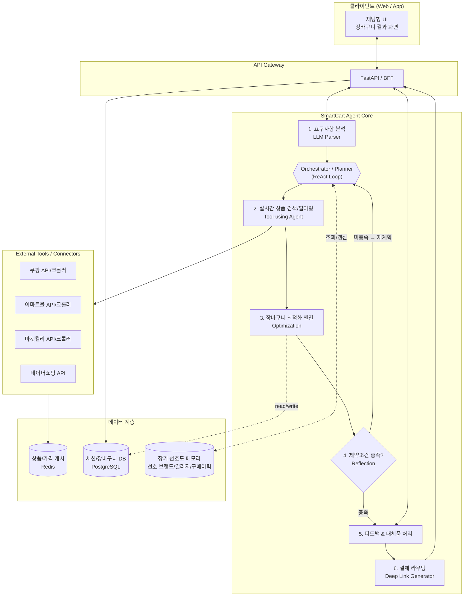

# SmartCart Agent 🛒🤖

> AI 기반 지능형 장보기 대행 에이전트
> 자연어 장보기 리스트를 입력하면 **최저가 · 최고 평점 · 희망 배송 시간**을 모두 만족하는
> 최적의 구매 조합을 찾아주고, 결제 직전까지 여정을 단축해주는 에이전트 서비스입니다.

---

## 1. 개요

사용자가 "삼겹살 1kg, 쌈장, 상추 한 봉지, 내일 아침 7시 전 도착, 예산 4만원 이하"처럼
구어체로 입력한 장보기 리스트를 분석하여,

1. 항목을 정형화하고 (브랜드/용량/수량 추론, 모호하면 확인 질문)
2. 여러 이커머스(쿠팡, 이마트몰, 컬리, 네이버 쇼핑 등)에서 실시간 가격·평점·배송 가능 시간을 조회하고
3. 배송비를 포함한 **최적 장바구니 조합(Optimization Pack)**을 계산하고, **예산/배송 제약을 스스로 검증**하여 미충족 시 자동으로 재계획하며
4. 사용자에게 제안 + 대체품 옵션을 제공하고
5. 각 쇼핑몰의 **딥링크/장바구니 링크**로 결제를 라우팅합니다.

---

## 2. 핵심 기능

### 🔹 1단계 — 지능형 아이템 매칭 및 최적화
- **자연어 파싱**: "대패삼겹살 대용량, 퐁퐁" → 브랜드/용량/수량을 추론해 정형 데이터로 변환
- **모호성 해소**: 파싱 신뢰도가 낮은 항목(예: "퐁퐁" → 세제 브랜드/용량 다수 존재)은 사용자에게 짧은 확인 질문을 던지거나, 가장 가능성 높은 후보 + 근거를 함께 제시
- **다중 조건 검색**: 가격 + 평점(예: 4.5/5.0 이상) 기준으로 여러 쇼핑몰 비교
- **최적 조합 생성**: 배송비를 포함한 총액이 최소가 되는 쇼핑몰 조합 + 직접 구매 링크 제공

### 🔹 2단계 — 유연한 대체품 추천 (Alternative Engine)
- **원클릭 교체**: 추천 상품이 마음에 들지 않으면 차순위 최저가/타 브랜드 동일 카테고리 상품 즉시 추천
- **조건별 필터**: '더 저렴한 상품', '평점 더 높은 상품', '유기농/친환경' 등 선호도 기반 정렬
- **품절/미존재 상품 자동 대응**: 요청한 상품이 검색 결과에 없거나 품절인 경우, 사용자에게 알리는 동시에
  - 동일 카테고리 내 유사 상품(브랜드/용량 차이)을 자동으로 재검색
  - 다른 쇼핑몰에서의 재고 여부를 함께 조회
  - "요청하신 OOO은(는) 현재 품절입니다. 대신 △△△(브랜드/용량 차이)을(를) 추천드립니다" 형태로 대체품을 제안

### 🔹 3단계 — 예산 및 배송 시간 동시 만족 (Budget & Delivery Routing)
- **예산 가드레일**: 설정된 예산을 초과하지 않도록 용량 조절 또는 가성비 브랜드로 자동 전환 제안
- **배송 타임라인 매칭**: 희망 도착 시간(예: "내일 아침 7시 전")을 만족하는 쇼핑몰(로켓프레시, 쓱배송, 컬리 등)만 필터링

---

## 3. 시스템 아키텍처

### 3.1 전체 구조도



### 3.2 처리 파이프라인 (Sequence)

```mermaid
sequenceDiagram
    actor User
    participant UI as 채팅 UI
    participant Parser as LLM Parser
    participant Search as 상품 검색 Agent
    participant Opt as 최적화 엔진
    participant Mall as 쇼핑몰 API/크롤러
    participant Router as 결제 라우터

    User->>UI: "내일 아침 7시 전, 삼겹살 1kg+쌈장+상추, 예산 4만원"
    UI->>Parser: 자유 텍스트 입력
    Parser->>Parser: JSON 구조화<br/>{item, qty, delivery_before, budget}
    Parser->>Search: 구조화된 요청 전달
    Search->>Mall: 상품 검색 (가격/평점/배송정보)
    Mall-->>Search: 후보 상품 리스트

    alt 요청 상품이 검색 결과에 없음/품절
        Search->>Search: 동일 카테고리 유사 상품 재검색<br/>(타 브랜드/용량/타 쇼핑몰)
        Search-->>UI: "OOO 품절 - 대체품 △△△ 제안"
    end

    Search->>Search: 배송시간 1차 필터 → 가격/평점 정렬
    Search->>Opt: 후보군 전달
    Opt->>Opt: 배송비 포함 조합 비교<br/>(단일몰 vs 분할구매)

    loop 제약조건(예산/배송시간) 미충족 시 자동 재계획
        Opt->>Opt: 예산 초과 또는 배송 미충족 여부 판단
        alt 미충족
            Opt->>Search: 재계획 요청<br/>(용량↓, 가성비 브랜드 전환,<br/>배송 빠른 몰로 재검색 등)
            Search->>Mall: 조정된 조건으로 재검색
            Mall-->>Search: 후보 상품 리스트(갱신)
            Search->>Opt: 후보군 재전달
        end
    end

    Opt-->>UI: 최적 장바구니 제안 + 대체품 가이드
    UI-->>User: 결과 카드 표시

    opt 사용자 대체품 요청
        User->>UI: "상추 대체품 보여줘"
        UI->>Search: 대체품 후보 재조회
        Search->>Opt: 재계산 요청
        Opt-->>UI: 갱신된 장바구니
    end

    User->>UI: 최종 확인
    UI->>Router: 확정된 장바구니 전달
    Router-->>UI: 쇼핑몰별 딥링크/장바구니 URL
    UI-->>User: 결제 페이지로 이동
```

### 3.3 모듈 구성

| 모듈 | 책임 | 주요 기술 |
|---|---|---|
| **Request Parser** | 자유 형식 입력 → 구조화 JSON 변환 (품목, 수량, 예산, 배송 기한). 신뢰도가 낮으면 명확화 질문 생성 | LLM (Function Calling / Structured Output) |
| **Orchestrator (Planner)** | 전체 작업을 하위 단계로 분해하고, Search→Optimize→Reflect 루프를 제어. Reflection 결과에 따라 재계획(Replan) 지시 | LLM Agent Loop (ReAct / Plan-Execute) |
| **Product Search Agent** | 쇼핑몰별 검색 도구 호출, 배송시간/가격/평점 1차 필터링 | LLM Tool-use, API Connector, Crawler |
| **Optimization Engine** | 배송비 포함 총액 최소화 조합 계산 (단일몰 vs 분할구매) | 조합 최적화 알고리즘 (Knapsack/Greedy + 제약조건) |
| **Reflection Module** | 산출된 조합이 예산/배송 제약을 만족하는지 자체 검증, 미충족 시 재계획 트리거 | 규칙 기반 검증 + LLM 평가 |
| **Alternative Engine** | 대체품 후보 정렬(가격/평점/친환경 등) 및 **품절/미존재 상품 발생 시 동일 카테고리 유사 상품 자동 탐색·제안** | 규칙 기반 + 검색 재호출 |
| **Deep Link Router** | 최종 장바구니 → 쇼핑몰별 상품/장바구니 URL 생성 | 쇼핑몰별 URL 스킴 매핑 |
| **Session Store** | 사용자 세션, 장바구니 상태, 피드백 이력 관리 | PostgreSQL / Redis |
| **Preference Memory** | 세션을 넘어선 장기 사용자 선호도(선호 브랜드, 알러지/제외 식품, 자주 구매하는 품목) 저장 및 검색 시 반영 | PostgreSQL (vector/structured) |

### 3.4 Agentic AI 요건 체크리스트

| 요건 | 설계 반영 내용 |
|---|---|
| **자율성 (Autonomy)** | 사용자가 결과를 거부하지 않는 한, 검색 → 최적화 → 제약조건 검증 → 재계획까지 사람 개입 없이 자동 수행 |
| **계획 & 재계획 (Plan & Replan)** | Orchestrator가 목표(예산/배송시간/평점)를 하위 작업으로 분해하고, Reflection에서 제약 미충족 시 용량 조절·브랜드 전환·재검색 등으로 자동 재계획 |
| **도구 사용 (Tool Use)** | Search Agent가 쇼핑몰 API/크롤러를 도구로 호출하여 실시간 데이터를 획득 |
| **반성/자기검증 (Reflection)** | Optimization 결과를 Reflection 모듈이 검증하고, 실패 시 루프를 통해 스스로 개선 |
| **메모리 (Memory)** | 세션 내 상태(Session Store)뿐 아니라 세션 간 장기 선호도(Preference Memory)를 활용해 다음 요청에 반영 |
| **모호성 해소 / Human-in-the-loop** | Parser 신뢰도가 낮은 항목은 사용자에게 확인 질문을 던지거나, 최선 추정 + 근거를 함께 제시. 최종 결제 전 사용자 확인 단계 유지 |
| **목표/제약 추적 (Goal Tracking)** | 예산·배송 기한·평점 기준이 파이프라인 전 단계에서 일관되게 추적되며, 최종 결과에 충족 여부를 명시 |

---

## 4. 데이터 모델 예시

### 4.1 구조화된 요청 (Parser 출력)

```json
{
  "items": [
    { "name": "삼겹살", "qty": "1kg", "category": "정육" },
    { "name": "쌈장", "qty": "1개", "category": "장류" },
    { "name": "상추", "qty": "1봉지", "category": "채소" }
  ],
  "budget": 40000,
  "delivery_before": "2026-06-12T07:00:00+09:00",
  "preferences": {
    "min_rating": 4.5,
    "organic_preferred": false
  }
}
```

### 4.2 최적화 결과 (Optimization Pack)

```json
{
  "total_price": 32500,
  "budget": 40000,
  "estimated_delivery": "2026-06-12T06:30:00+09:00",
  "delivery_satisfied": true,
  "cart": [
    {
      "mall": "쿠팡 (로켓프레시)",
      "product": "한돈 삼겹살 구이용 (냉장) 1kg",
      "price": 24900,
      "rating": 4.6,
      "delivery_window": "내일 새벽 7시 전 도착",
      "url": "https://link.coupang.com/..."
    },
    {
      "mall": "쿠팡 (로켓프레시)",
      "product": "해찬들 사계절 쌈장 500g",
      "price": 2800,
      "rating": 4.7,
      "delivery_window": "내일 새벽 7시 전 도착",
      "url": "https://link.coupang.com/..."
    },
    {
      "mall": "이마트 (쓱배송)",
      "product": "무농약 청상추 150g",
      "price": 4800,
      "rating": 4.4,
      "delivery_window": "내일 오전 06:00~09:00",
      "url": "https://emart.ssg.com/..."
    }
  ],
  "alternatives": [
    {
      "for_item": "무농약 청상추 150g",
      "suggestion": "쿠팡 로켓프레시 상추",
      "price": 6000,
      "price_diff": 1200,
      "reason": "새벽 배송 확실"
    }
  ]
}
```

---

## 5. 기술 스택 (제안)

| 영역 | 후보 기술 |
|---|---|
| LLM / 에이전트 프레임워크 | Claude (Function Calling / Tool Use), LangGraph or custom orchestration |
| 백엔드 API | Python (FastAPI) |
| 상품 데이터 수집 | 공식 Open API 우선, 비공식 채널은 크롤러 (Playwright/requests) |
| 캐시 | Redis (가격/상품 캐시 TTL 관리) |
| DB | PostgreSQL (세션, 장바구니, 사용자 선호도) |
| 프론트엔드 | React / Next.js (채팅형 UI + 카드형 결과 뷰) |
| 배포 | Docker, CI/CD (GitHub Actions) |

---

## 6. 향후 로드맵

- [ ] 1단계: 자연어 파서 + 단일 쇼핑몰(쿠팡) 연동 PoC
- [ ] 2단계: 다중 쇼핑몰 비교 및 배송비 포함 최적화 알고리즘
- [ ] 3단계: 대체품 추천 엔진 + UI 인터랙션
- [ ] 4단계: 예산 가드레일 + 배송 타임라인 필터
- [ ] 5단계: 딥링크 결제 라우팅 및 사용자 피드백 루프

---

## 7. 라이선스

이 프로젝트는 [LICENSE](./LICENSE) 파일을 따릅니다.
